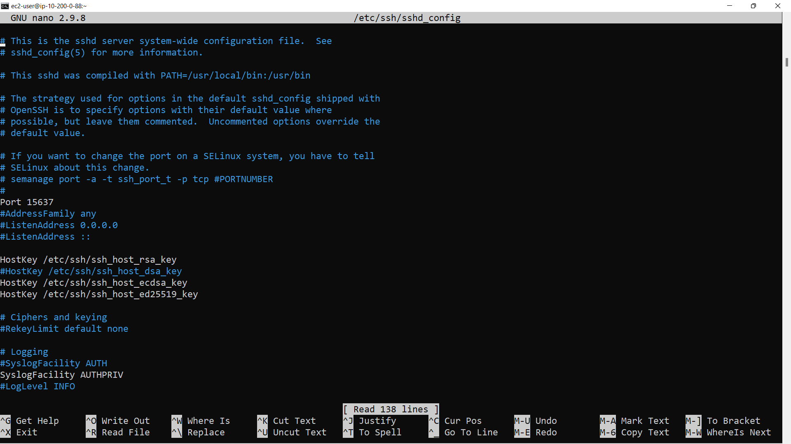

# Task 4 Answers a,b,c,d

# a.   
The SSH public key located in ~/.ssh/authorized_keys and the algorithm it uses. [5 marks]
# SSH Public Key
```
ssh-rsa AAAAB3NzaC1yc2EAAAADAQABAAABAQCIbdeXPi9LS2fM4DNJKzKZQGg9jMugOcqEPAlY3UjPn/E3h8wlgm5NaNNczyUbXAUQ+eXi47aXdEhPFsYWjqZSN+yBzjhGnMCHQmTROiMzOo9VV7BTtUFHMHGiK9fKrTtFn7f4Yt8kU3iQOS6cNlh/x0V9PQARUOLrhfeUZ3DjGBuOJZ4Ucxw5HtteMfhse2osUfFTulnl4Fcw4DFUTH1oe/E7Osqmabp2h43/pTxTResI2FfTk2xbRR8ToLOH5F00Qv0V6MdoH6aAcQu8SkL81tFfHtfRS/PsJG5AqkAsC8tg/t0WnSDB6RKl4GgKjt2EblSPfxsTPfEEpsCqN3NR vockey
```
# Algorithm Type
```
This public key is an RSA algorithm.
```
# b.   
The command used to change the API server port number (last 5 digits of your student ID
number) which needs to be opened under security group settings. [5 marks]

The code needed to change the port number is found in...

```
ssh --help.
```
The reference is listed as 

```
--port INTEGER
```
The command is...

```
uvicorn main:app --port 63724
```
I could also run the following to specify the listen address host at the same time.

```
uvicorn main:app --port 63724 --host 0.0.0.0
```

The following are screenshots of the command prompt and the browser return. The latter generated by writeout of a main.py file in nano via the command prompt.

Command Prompt Screenshot


Browser Screenshot
    
     

# c.   
Changing your SSH server port number can reduce the amount of bruteforce attempts that
spam your SSH logs. Change your SSH server port number to the first 5 digits of your student ID
number. Write down the name of the file and the line you would need to change in order to
change the SSH. [5 marks]

```
The file I changed was sshd_config, listed by path /etc/ssh/sshd_config.  The line I changed was in paragraph 5 where the Port was listed originally as Port 22. I changed it to Port 15637 from the first 5 digits of my student number.

```
/etc/ssh/sshd_config showing original server #Port 22


/etc/ssh/sshd_config showing new server Port 15637



Organisation as a Custom TCP on the AWS console


# d.   
The hashing algorithm you chose earlier for the /hash_password route, and depending on which you chose, list its strengths and weaknesses. [5 marks]

```python
@app.post("/hash_password")
def hash_password(input_str):
    pw = ("SHA-256:", hashlib.sha256(input_str.encode()).hexdigest()) 
    return pw
```
# Strengths & Weaknesses of SHA-256
I used SHA-256 for the hashing algorithm. SHA-256 is up to 30% slower than its predecessors, MD5 and SHA-1. However it is currently considered much more secure. As its name suggests, SHA-256 returns hash values of 256 bits, or 64 hexadecimal units. Respectively MD5 returns a 128 bit hash and SHA-1 returns a 160 bit hash. 

An ideal hash function is;
* very fast
* returns a large range of hash values
* generates a unique hash per unique input
* generates very dissimilar hash values for similar input values
* generates no discernable pattern in its distribution ie unlike Turings "Heil, Hitler!"

SHA-256 using 256 bits addresses all but the first points in a superior way to using 128 bit and 160 bit hash functions. As previous hash functions are significantly faster than SHA-256, MD5 is still used for hash functions which are not security critical. For example MD5 is still used for database partitioning and computing checksums to validate file transfers. As 128 bit and 160 bit hash functions became security obsolete, it seems reasonable to suggest that by the same logic SHA-256 may be superceeded by some greater bit return function. However currently SHA-256 is considered to possess as many possible values as there are atoms in the universe...

source https://www.freecodecamp.org/news/md5-vs-sha-1-vs-sha-2-which-is-the-most-secure-encryption-hash-and-how-to-check-them/
by Jeff M Lowery