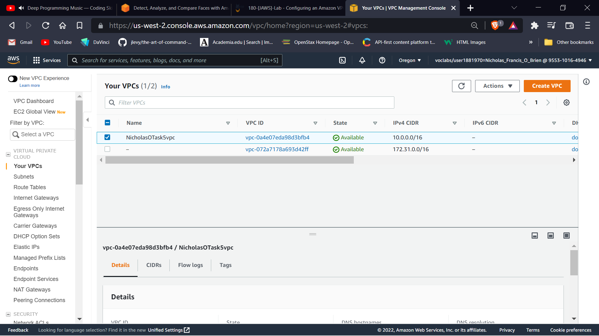
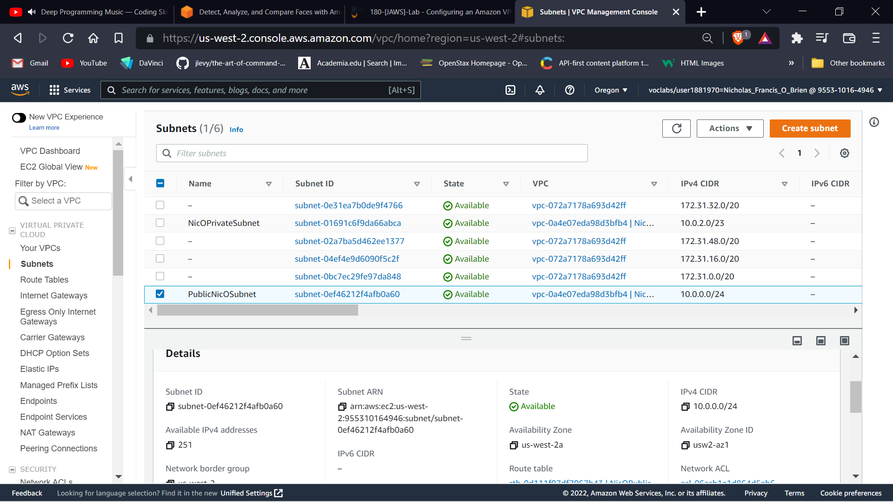
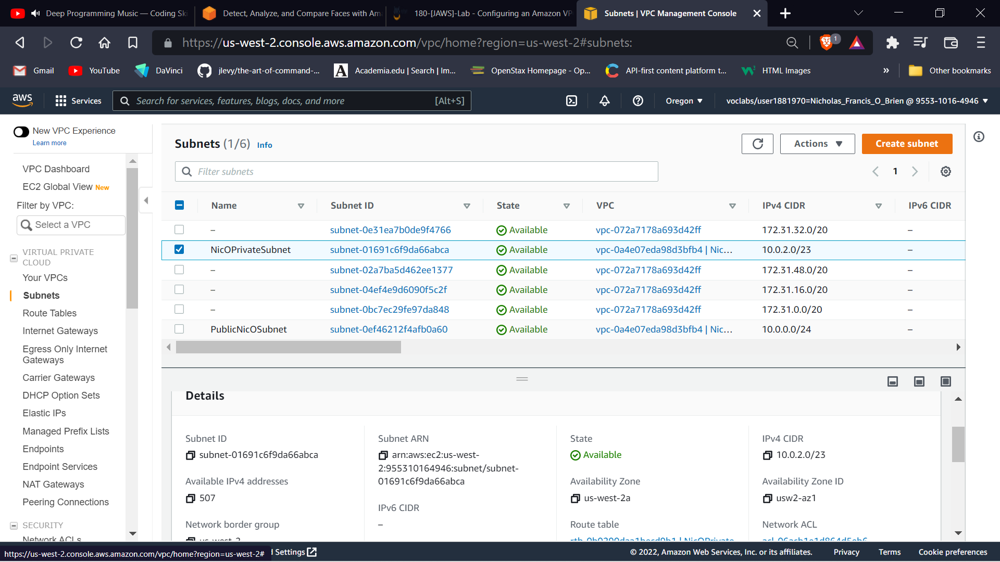
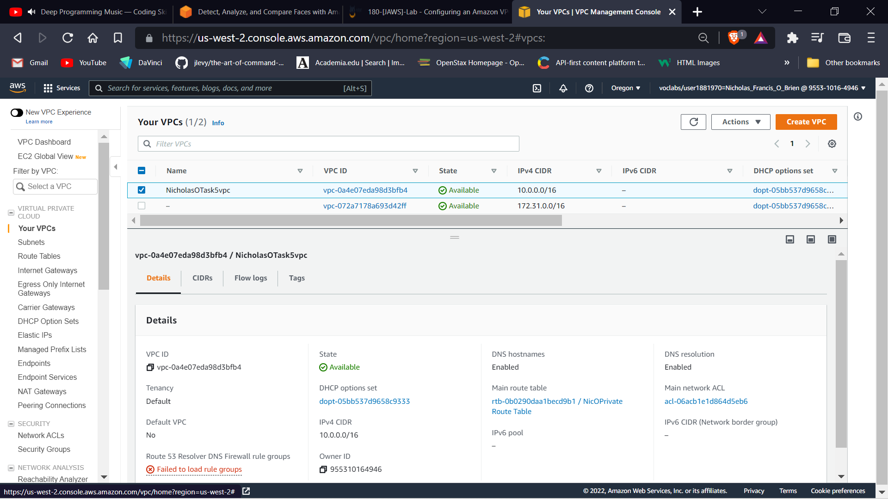
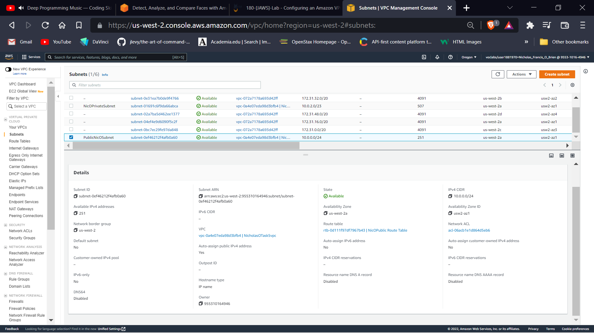
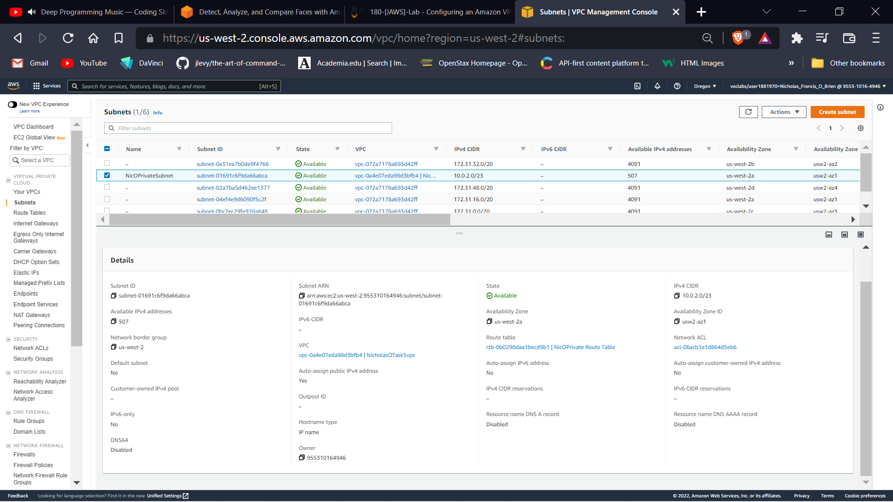
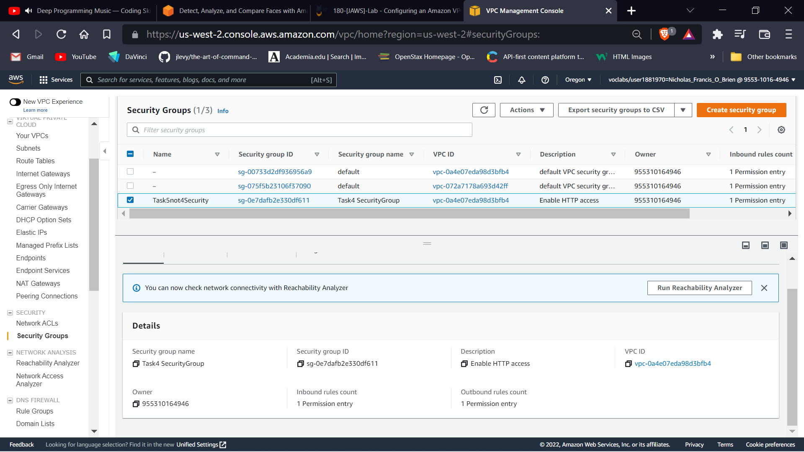
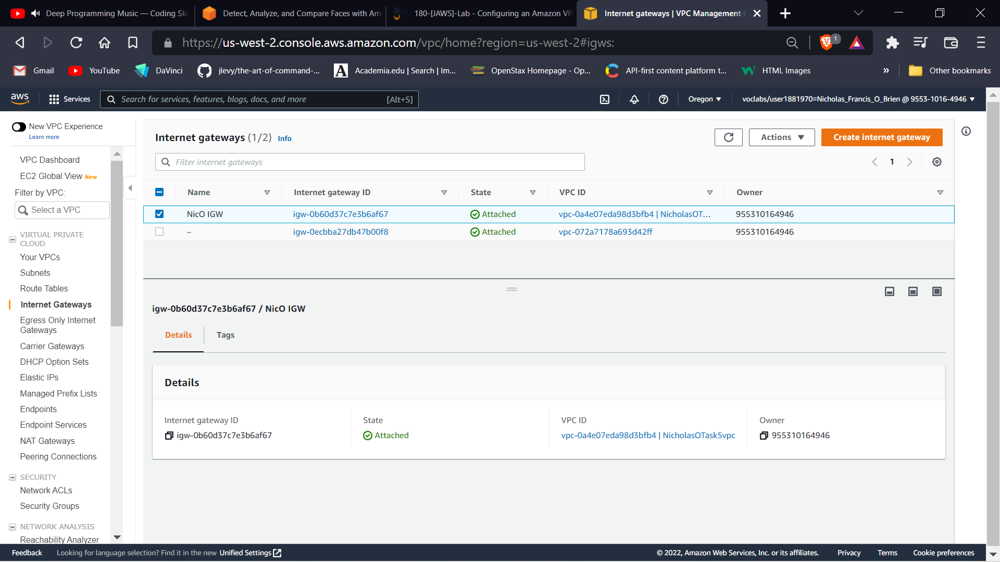

# Task 5 - Networking [10] marks.

Create a Networking.md file in your GitHub repository add the following details.

# a. 
VPC Name and VPC ID: (Include your first name in the VPC name) [1 mark]

```
VPC name = NicholasOTask5vpc
VPC ID = vpc-0a4e07eda98d3bfb4
```
Screenshot showing VPC name and VPC IDVPC name = NicholasOTask5vpc VPC ID = vpc-


# b. 
Public & Private Subnet CIDR Blocks [1 mark]

```
PublicNicOSubnet CIDR block 10.0.0.0/24
```


```
NicOPrivateSubnet CIDR block 10.0.2.0/23
```


# c. 
Screenshot of VPC details [2 mark]

VPC details



# d. 
Screenshots of Subnet details [2 marks]

PublicNicOSubnet details



NicOPrivateSubnet details



# e. 
Screenshots of Security Group details [2 marks]

Task5not4Security details



# f. 
Screenshot of Internet Gateway details [2 marks]

NicO IGW details


