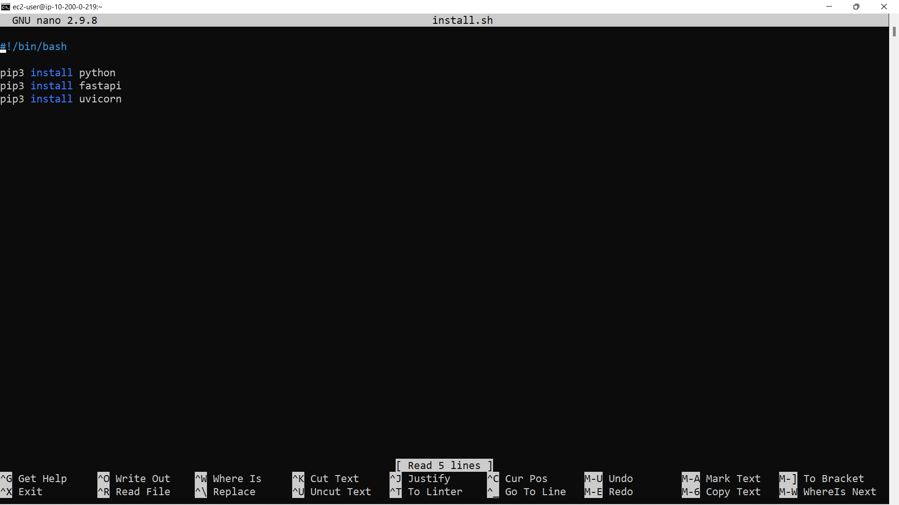
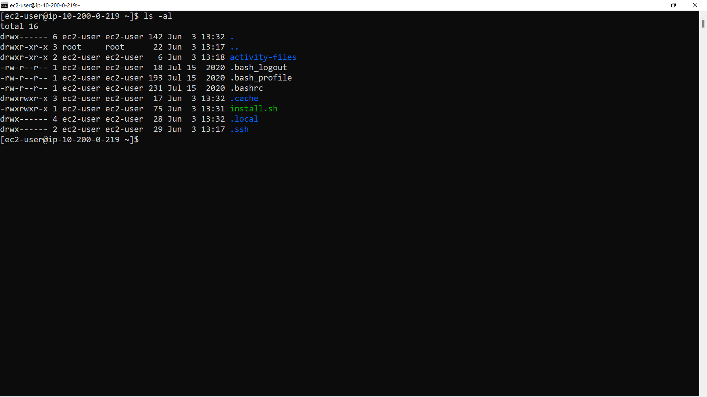
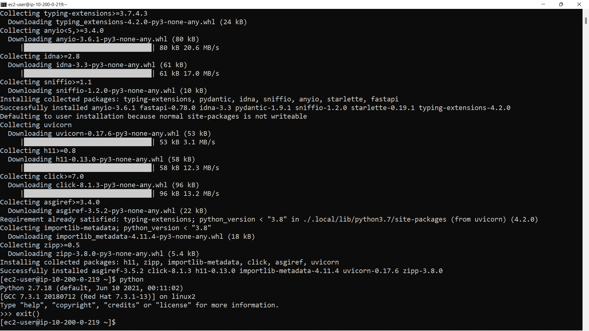
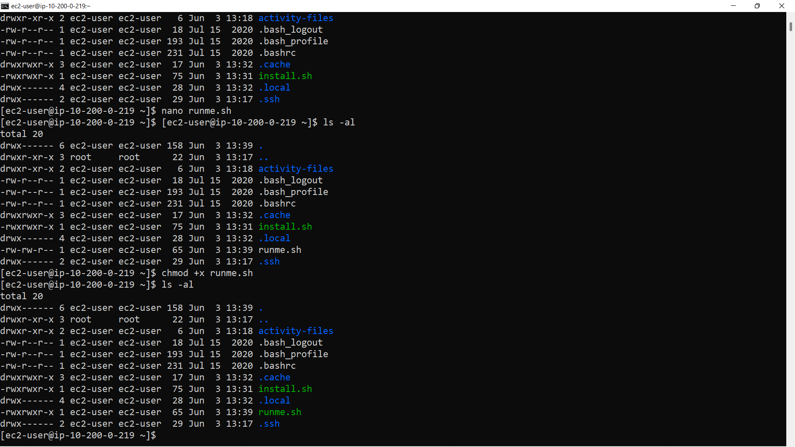

# Task 6 - Shell Scripting – 10 Marks

# a.  
Create a simple shell script named install.sh which installs the latest version of Python and the 
required Python libraries (fastapi & uvicorn). [5 marks]

install.sh
  

install.sh made executable
  

installed python install.sh
  

# b.  
Create a simple shell script named runme.sh which runs the uvicorn webserver on a publically 
accessible IP address (0.0.0.0:54321) when the user types ./runme.sh into a shell. [5 marks]

nano runme.sh

  

runme.sh executable
  
